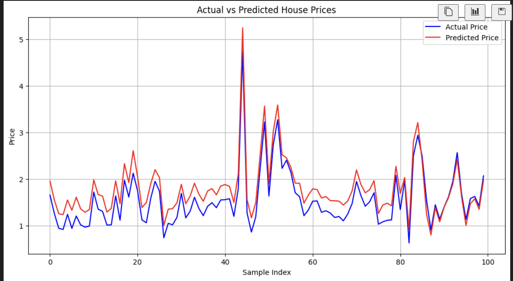

# Machine-learning (Multiple Linear Regression)
# Project Description
This project implements Multiple Linear Regression using NumPy from scratch, without using high-level ML libraries. The model is trained using Gradient Descent and predicts house prices based on various features. It includes manual feature scaling, bias handling, custom training loops, and evaluation plots.
### Features
- Feature Scaling using z-score normalization
- Custom implementation of Gradient Descent
- Multiple Linear Regression for prediction
- Loss tracking and visualization
- Actual vs Predicted price plot

### Tech Stack
- Python 3.x
- NumPy
- Matplotlib
- Jupyter Notebook
- pandas
- sklearn.datasets (fetch_california_housing)
(Optional: Pandas, Scikit-learn for comparison)

### Project Structure
.
├── multiple_linear_regression.ipynb  # Main Jupyter notebook
├── README.md                         # Project documentation
├── dataset.csv                       # Sample dataset (if used)

### How to Run the Project

1. Clone the repository:
   git clone https://github.com/yourusername/multiple-linear-regression.git

2. Install dependencies:
   pip install numpy matplotlib jupyter

3. Open the notebook:
   jupyter notebook multiple_linear_regression.ipynb

### usage

- Run all cells in the notebook.
- Modify the input data if needed.
- Check the final plot comparing Actual vs Predicted Prices.
- Use the trained model to predict new values manually or extend with Flask for a web app.

### sample result 

